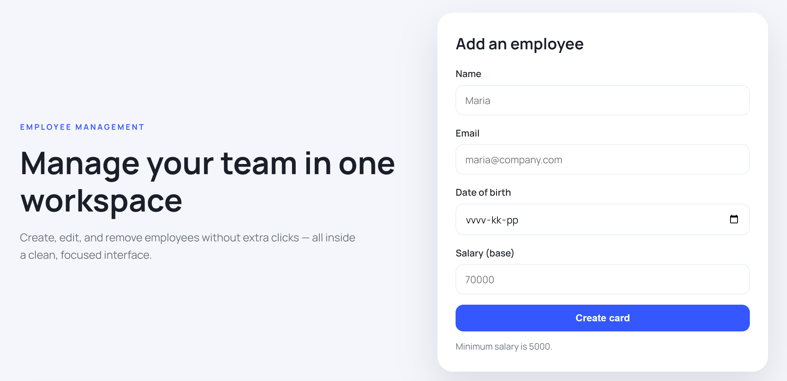
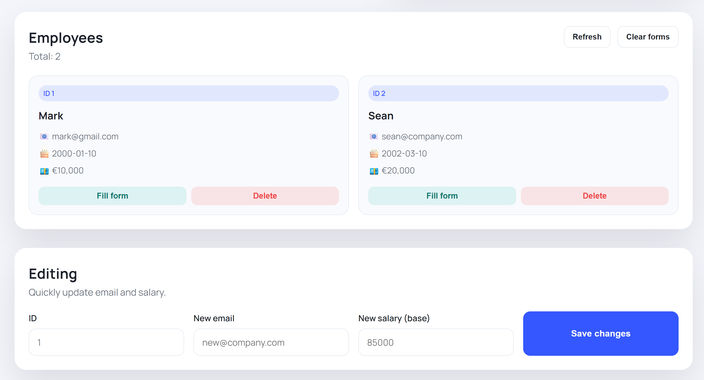

# 🔗 Live Demo
👉 **Try it here:** https://java-employee-application.onrender.com/


# 👥 Java Employee CRUD Service

Lightweight employee management CRUD service built with **Java + Spring Boot**.  
Provides REST endpoints to create, read, update, and delete employees, backed by **PostgreSQL**.

---

## ✨ Features

- ✅ Employee CRUD (Create / Read / Update / Delete)
- 🌐 REST API (JSON)
- 🐘 PostgreSQL persistence
- 🗃️ Spring Data JPA / Hibernate
- 📦 Maven build

---

## 🛠️ Tech Stack

- ☕ Java
- 🌱 Spring Boot
- 🔄 Spring Web (REST)
- 🗃️ Spring Data JPA / Hibernate
- 🐘 PostgreSQL
- 📦 Maven



---

## 🧱 Employee Model

| Field     | Type      |
|-----------|-----------|
| id        | Long      |
| name      | String    |
| email     | String    |
| birthDate | LocalDate |
| salary    | Integer   |

---

## ⚙️ Configuration

The app uses environment variables (see `src/main/resources/application.properties`):

- `SPRING_DATASOURCE_URL` (e.g. `jdbc:postgresql://localhost:5432/employees_db`)
- `SPRING_DATASOURCE_USERNAME` (e.g. `postgres`)
- `SPRING_DATASOURCE_PASSWORD` (e.g. `postgres`)
- `PORT` *(optional, default: `8080`)*

> ⚠️ `spring.jpa.hibernate.ddl-auto=create` recreates DB schema on each start.

---

## 🚀 Run Locally

### 1) Start PostgreSQL (Docker)

```bash
docker run --name employees-postgres \
  -e POSTGRES_DB=employees_db \
  -e POSTGRES_USER=postgres \
  -e POSTGRES_PASSWORD=postgres \
  -p 5432:5432 \
  -d postgres:16
```

### 2) Run the application

#### macOS / Linux

```bash
export SPRING_DATASOURCE_URL="jdbc:postgresql://localhost:5432/employees_db"
export SPRING_DATASOURCE_USERNAME="postgres"
export SPRING_DATASOURCE_PASSWORD="postgres"
export PORT=8080

./mvnw spring-boot:run
```

#### Windows (PowerShell)

```powershell
$env:SPRING_DATASOURCE_URL="jdbc:postgresql://localhost:5432/employees_db"
$env:SPRING_DATASOURCE_USERNAME="postgres"
$env:SPRING_DATASOURCE_PASSWORD="postgres"
$env:PORT="8080"

.\mvnw spring-boot:run
```

---

## 📚 API Endpoints

Base path: `/api/employees`

| Method | Endpoint              | Description        |
|-------:|-----------------------|--------------------|
| GET    | `/api/employees`      | Get all employees  |
| GET    | `/api/employees/{id}` | Get employee by id |
| POST   | `/api/employees`      | Create employee    |
| PUT    | `/api/employees/{id}` | Update employee    |
| DELETE | `/api/employees/{id}` | Delete employee    |

---

## 🧪 Example Requests

### Create employee

```bash
curl -X POST http://localhost:8080/api/employees \
  -H "Content-Type: application/json" \
  -d '{
    "name": "John Doe",
    "email": "john.doe@example.com",
    "birthDate": "1995-06-15",
    "salary": 2500
  }'
```

### Get all employees

```bash
curl http://localhost:8080/api/employees
```

### Update employee

```bash
curl -X PUT http://localhost:8080/api/employees/1 \
  -H "Content-Type: application/json" \
  -d '{
    "name": "John Doe",
    "email": "john.updated@example.com",
    "birthDate": "1995-06-15",
    "salary": 3200
  }'
```

### Delete employee

```bash
curl -X DELETE http://localhost:8080/api/employees/1
```

---

## 📦 Build & Test

```bash
./mvnw clean package
./mvnw test
```
